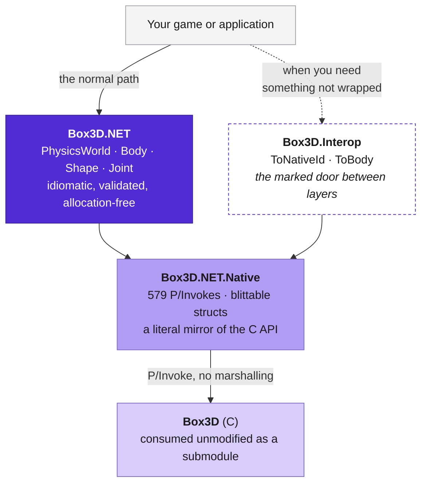
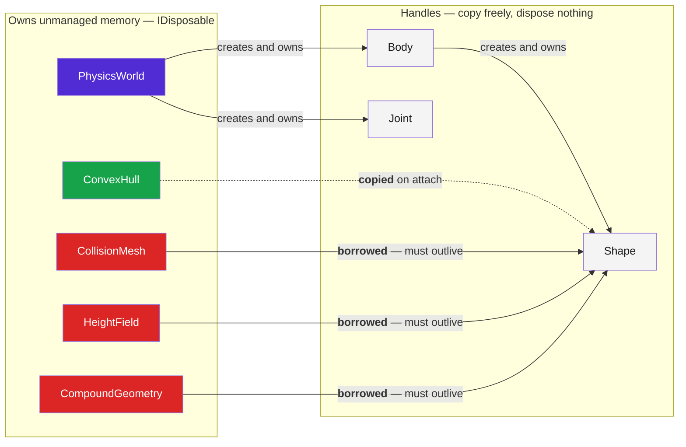
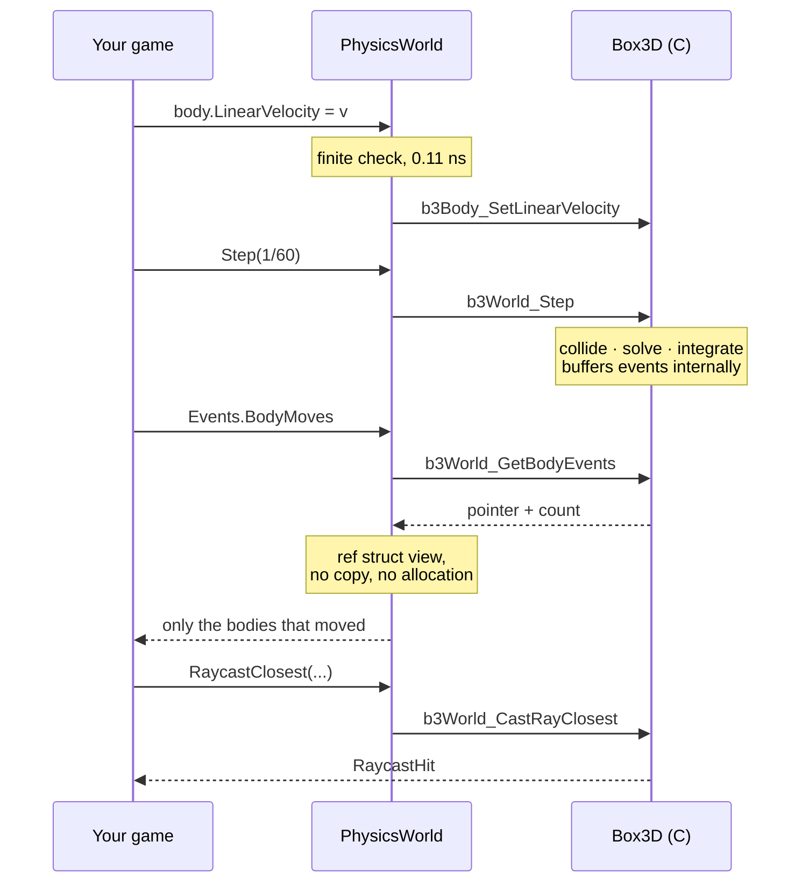
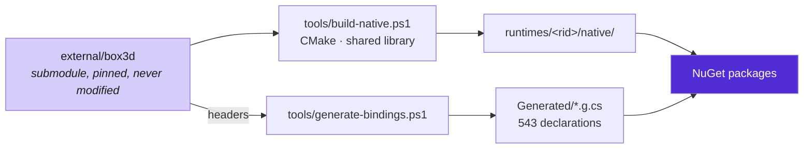

# Architecture

How the pieces fit, and why they are arranged this way.

## The layers



The rule is that `Box3D.NET` never names a `Box3D.NET.Native` type in public
API. If it did, every consumer touching a handle would take a compile-time
dependency on the C ABI and the two packages could no longer version
independently. `LayeringTests` enforces it by reflection over the built
assembly, because a rule like this decays quietly.

Dropping to the native layer stays possible, because a thin wrapper should not
be a ceiling — Box3D exports around 580 functions and the idiomatic surface does
not cover all of them. But it goes through `Box3D.Interop`, so the coupling
appears as a `using` in your own source rather than happening by accident.

## What owns what

The single most important diagram, because it is the one thing you can get
wrong in a way that crashes rather than throws.



Read the arrow colours:

- **Green** — a hull is interned into the world when attached, so it may be
  disposed the moment the shape exists.
- **Red** — a mesh, height field or baked compound is *borrowed*. The shape holds
  a pointer into it. Disposing it while a shape is alive is a use-after-free
  inside the solver. **Dispose the world first.**
- **Grey** — bodies, shapes and joints own nothing. They die with their world.

```csharp
using var terrain = HeightField.FromHeights(heights, 256, 256, scale);

using (var world = new PhysicsWorld())
{
    world.CreateStaticBody().AddHeightField(terrain);
    Simulate(world);
}
// World disposed here, terrain after. Never the other way round.
```

None of the disposable types has a finalizer. A finalizer runs on the GC thread
at a time of the runtime's choosing, and freeing a world mid-step, or a mesh a
live shape still points at, corrupts rather than leaks. Forgetting to dispose
leaks until the process exits, which is a bug you can see; freeing early is one
you cannot.

## A frame



Events are buffered by Box3D during the step and handed back afterwards rather
than raised as callbacks, because the solver is multithreaded and because
applications usually want to change the world in response — which is unsafe
mid-step. `WorldEvents` exposes them as `ref struct` views over engine memory,
so reading a frame's worth allocates nothing. They are valid only until the next
step.

## Why query callbacks are structs


The query is generic over the callback type, so the JIT specialises it and
devirtualises the call: your `OnHit` is inlined into the dispatcher with no
delegate allocation and nothing to keep alive across the transition.

The one indirection exists because `[UnmanagedCallersOnly]` cannot be applied to
a generic method. The context carries a *managed* function pointer to a generic
helper, which may be generic precisely because it is not the
`UnmanagedCallersOnly` one, and the non-generic native thunk calls through it.
That is one indirect call per hit, against an allocation and a GC handle per
query for the delegate design.

Measured: a ray cast with a struct callback runs at 163 ns against 167 ns for
the callback-free convenience method, and allocates nothing.

## The build



Box3D is a submodule pinned to a commit and never modified. Both the binding and
the binary are derived from it, which is what makes an upgrade a matter of
moving the submodule, re-running two scripts and reading the diff. CI fails if
the checked-in generated sources differ from what the script produces.
