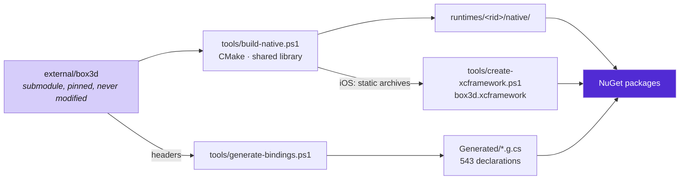

# Architecture

How the binding is produced and how it is held to the C API. This page is for
contributors and for anyone deciding whether to trust the layer between their
game and Box3D.

Using the library needs none of it: [the native layer](concepts/native-layer.md)
covers the packages and where the boundary is, and
[Memory and ownership](concepts/ownership.md) covers what owns what.

## The build



Box3D is a submodule pinned to a commit and never modified. Both the binding and
the binary are derived from it, which is what makes an upgrade a matter of
moving the submodule, re-running two scripts and reading the diff:

```sh
git -C external/box3d checkout <commit>
pwsh tools/generate-bindings.ps1     # re-emit the P/Invokes and record the commit
pwsh tools/dump-abi.ps1              # re-record the struct layouts
dotnet test -c Release
```

CI fails if the checked-in generated sources differ from what the scripts
produce, which is the point of them.

Every platform but one follows the top path: a shared library staged under
`runtimes/<rid>/native/`, which is the layout NuGet resolves from at run time.
iOS is the exception, and the second edge exists because of it. Apple does not
allow an application to load a dynamic library that is not a signed framework in
its bundle, so the iOS build produces static archives instead, which are merged
into an `xcframework` and linked into the consuming application by a `.targets`
file the package carries. That is also why the binding names `__Internal` rather
than `box3d` under the iOS target framework: there is no file to load, because
the symbols are already in the application's own executable.

## The bindings are generated

`tools/generate-bindings.ps1` produces the 543 P/Invoke declarations from the
Box3D headers, converting the Doxygen comments into XML documentation along the
way. A mistyped parameter in a hand-written binding does not fail to compile; it
corrupts the stack at run time. Generating removes that class of bug.

A C type the script has not been taught is a hard error rather than something
passed through, and `BindingSource.Commit` records which Box3D revision the
declarations came from, so an assembly can be traced back to its headers.

Thirty-six functions are still bound by hand, and one deliberately is not —
[API coverage](api-coverage.md) lists all of them.

## The struct layouts are checked against a C compiler

The declarations are generated, but the structs they pass are hand-written
mirrors, and nothing about C# forces a mirror to match. A field of the wrong
width, or two fields swapped, compiles and runs: the call succeeds and reads the
wrong bytes, so a body ends up with its restitution in the friction slot. There
is no crash to investigate.

`tools/dump-abi.ps1` compiles a program against the real Box3D headers that
prints `sizeof`, `_Alignof` and `offsetof` for every field, and records the
answers in `abi/native-layout.json`. The test suite holds all 92 structs to that
file — size, every field offset, blittability, and whether a mirror exists at
all — and CI regenerates it, so a submodule bump that moves a field fails the
build instead of shipping.

## The layering rule is enforced, not documented

`Box3D.NET` never names a `Box3D.NET.Native` type in public API. `LayeringTests`
checks that by reflection over the built assembly, because a rule like this
decays quietly — one convenient property and nothing fails.

The sanctioned way down is `Box3D.Interop`, which is a `using` in the consumer's
own source rather than an accident.

## What CI verifies

| | |
| --- | --- |
| Every test, on every supported platform | including determinism, threading, leaks and allocation |
| The packed `.nupkg`, installed into a project that has never heard of this repository | which is the only check that exercises NuGet asset resolution rather than `bin/` |
| The samples, published with NativeAOT | which proves nothing on those paths needs the JIT |
| Generated sources and the ABI dump against the headers | so a submodule bump cannot land silently |
| The public API against the last published package | a break is allowed before 1.0, but it belongs in the changelog |

`AllocationTests` is the one worth knowing about before writing code here: it
measures the documented hot paths with `GC.GetAllocatedBytesForCurrentThread`
and requires exactly zero bytes, so a captured closure or a boxed enumerator
fails the build.

The repository README has the commands, the platform matrix and the full list of
test suites.
