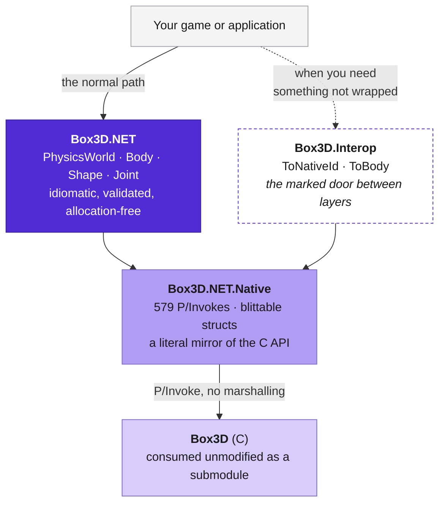
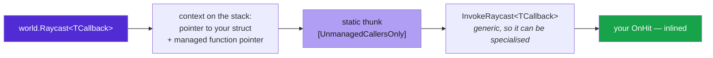

# The native layer

**Most users should use `Box3D.NET` and never read this page.**
`Box3D.NET.Native` is the raw P/Invoke layer: a one-to-one mirror of the Box3D C
API, with the same names, the same signatures and no abstraction. Reach for it
when you need one of the roughly 580 exported functions the idiomatic surface
does not cover yet.



## The safety rules, once

Everything in `Box3D.NET.Native` and `Box3D.Interop` follows the C API's
contract, which assumes the caller knows what it is doing:

| | `Box3D.NET` | `Box3D.NET.Native` |
| --- | --- | --- |
| Validates handles | yes, throws | **no, undefined behaviour** |
| Rejects NaN and infinity | yes, throws | **no** |
| Manages lifetimes | the world owns its objects | **you do** |
| Guards world creation | yes, process-wide mutex | **no** |

Passing an invalid identifier crashes the process rather than raising an
exception. Passing a NaN contaminates the world silently. Those two sentences
are the whole difference, and they are not repeated on the individual functions.

## Going down a level

`Box3D.NET` never names a `Box3D.NET.Native` type in public API. If it did,
every consumer touching a handle would take a compile-time dependency on the C
ABI, and the two packages could no longer version independently.
`LayeringTests` enforces that by reflection over the built assembly, because a
rule like this decays quietly — one convenient property and nothing fails.

Dropping down is still supported, because a thin wrapper should not be a
ceiling. It goes through `Box3D.Interop`:

```csharp
using Box3D.Interop;
using Box3D.Native;

b3BodyId raw = body.ToNativeId();
B3.b3Body_SetName(raw, name);

Body back = raw.ToBody();
```

Importing that namespace is the point: the coupling shows up as a `using` in
your own source rather than being the path of least resistance.

[API coverage](../api-coverage.md) lists every exported function and whether the
idiomatic layer reaches it. `NATIVE_ONLY` is not a to-do list — most of it is
machinery an idiomatic API should not surface: individual accessors a single
property reads several of at once, recording and replay, tree internals,
profiling counters.

## Why callbacks are structs



Queries are generic over the callback type, so the JIT specialises them and
devirtualises the call: your `OnHit` is inlined into the dispatcher with no
delegate allocation and nothing to keep alive across the transition.

The one indirection exists because `[UnmanagedCallersOnly]` cannot be applied to
a generic method. The context carries a *managed* function pointer to a generic
helper — which may be generic precisely because it is not the
`UnmanagedCallersOnly` one — and the non-generic native thunk calls through it.
That is one indirect call per hit, against an allocation and a GC handle per
query for the delegate design.

Measured: a ray cast with a struct callback runs at 168.9 ns against 171.7 ns
for the callback-free convenience method, and allocates nothing.

## Marshalling, or the absence of it

The native assembly is compiled with `DisableRuntimeMarshalling`. Every P/Invoke
is a direct call with arguments passed as they already sit in memory, and any
accidentally non-blittable type is a compile error instead of a silent
field-by-field copy. Booleans cross the boundary as `NativeBool`, a one-byte
value type matching C's `_Bool`.

Vectors need no conversion either: `b3Vec3` and `System.Numerics.Vector3` have
the same layout, as do `b3Quat` and `Quaternion`. `LayoutTests` asserts that
rather than trusting it.

## Single precision only

Box3D's `BOX3D_DOUBLE_PRECISION` "large world" mode changes the ABI rather than
being a runtime switch. This binding targets the default single-precision build
and asserts at test time that the loaded library agrees. Large-world support, if
it lands, will be a separate package.

## Where the bindings come from

They are generated from the Box3D headers rather than written by hand, and the
struct layouts are checked against what a C compiler reports for the same
declarations. [Architecture](../architecture.md) covers that pipeline.
