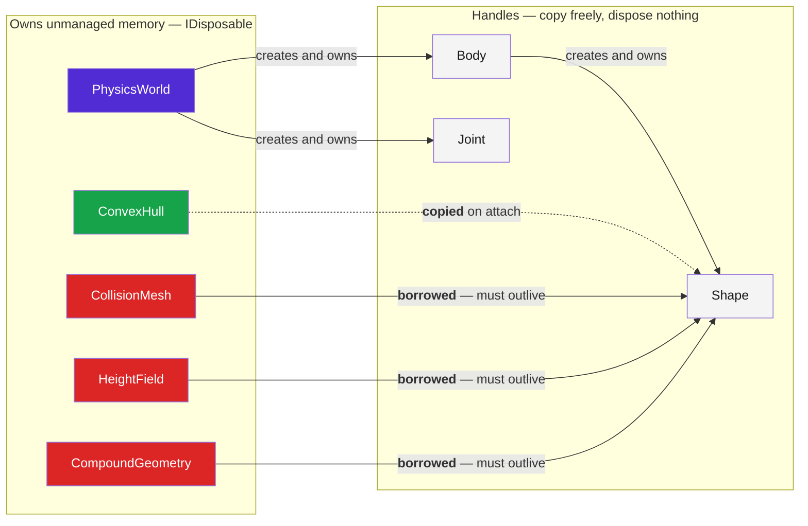

# Memory and ownership

This is the one thing in the library you can get wrong in a way that crashes
rather than throws.



## The rules

| | Copied on attach | Dispose |
| --- | --- | --- |
| `Sphere`, `Capsule`, `Box` | yes, by value | nothing to dispose |
| `ConvexHull` | yes, interned in the world | any time, even before the world |
| `CollisionMesh` | **no, borrowed** | **after the world** |
| `HeightField` | **no, borrowed** | **after the world** |
| `CompoundGeometry` | **no, borrowed** | **after the world** |
| `Body`, `Shape`, `Joint` | — | never; they die with the world |

A borrowed geometry is one the shape holds a pointer into. Disposing it while a
shape is alive is a use-after-free inside the solver: not an exception, not a
`NullReferenceException`, a crash or worse.

```csharp
using var terrain = HeightField.FromHeights(heights, 256, 256, scale);

using (var world = new PhysicsWorld())
{
    world.CreateStaticBody().AddHeightField(terrain);
    Simulate(world);
}
// World disposed here, terrain after. Never the other way round.
```

Declaring the geometry first and the world second, as above, gets the order
right by construction: `using` disposes in reverse.

## Only the world owns the simulation

`PhysicsWorld` is the only type that owns the simulation's memory. `Body`,
`Shape` and `Joint` are handles into it — small value types you can copy, store
and pass between threads freely. Making them `IDisposable` would imply an
ownership they do not have.

Destroying a world destroys everything in it. There is nothing else to release,
and nothing to release in any particular order.

## There are no finalizers

Not on `PhysicsWorld`, and not on any of the disposable geometry types. This is
a deliberate departure from the usual guidance.

A finalizer runs on the GC thread at a time of the runtime's choosing. Freeing a
world while another thread is inside `Step`, or freeing a mesh a live shape
still points at, corrupts the simulation rather than merely leaking. The
alternative failure — forgetting to dispose — leaks until the process exits,
which is a bug you can see:

```csharp
Console.WriteLine(PhysicsWorld.Count);   // climbing, and capped at MaxCount
```

Visible and diagnosable beats a use-after-free that only shows up under load.

## Checking for leaks

Every disposable geometry exposes `ByteCount`, and the native layer can report
the process-wide total:

```csharp
using Box3D.Native;

int before = B3.b3GetByteCount();
// ... create and destroy worlds, meshes, hulls ...
int after = B3.b3GetByteCount();       // should be back where it started
```

That is exactly what the test suite does after every create-and-destroy cycle,
which is why the ownership rules above are asserted rather than assumed.

## Related

- [Handle validity](handles.md) — what happens when you use a handle after its
  world or body is gone.
- [Terrain and meshes](../guides/terrain.md) — the three borrowed kinds, and
  what each is for.
