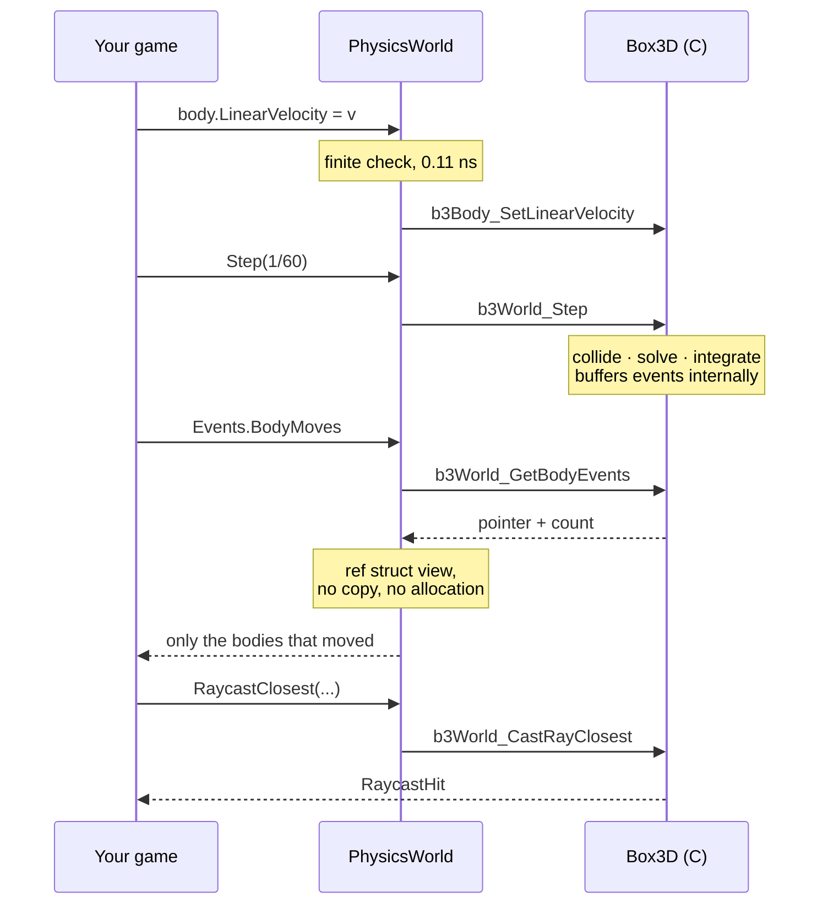

# The simulation step

`world.Step(timeStep, subStepCount)` is where collision detection, constraint
solving and integration happen. Nothing else moves the simulation.



## Keep the step fixed

A varying step makes the simulation irreproducible and hurts stability. Decouple
it from the frame rate with an accumulator, and clamp the input so that one long
frame does not spiral into a hundred catch-up steps:

```csharp
const float FixedStep = 1.0f / 60.0f;

accumulator += MathF.Min(deltaTime, 0.25f);

while (accumulator >= FixedStep)
{
    world.Step(FixedStep);
    accumulator -= FixedStep;
}
```

Interpolate between the last two physics poses if you need to render at a
higher rate than you simulate. Do not step by the frame time to get there.

## Sub-steps

The second argument is how many solver sub-steps to take within the step. More
is more accurate and more expensive; four is the usual choice and the default.
Raise it for stacks that sag or joints that stretch, not for tunnelling —
that is what continuous collision is for.

Sub-step count is part of the input to the simulation, so changing it changes
the result. Keep it fixed for the same reason the time step is fixed.

## Events are buffered, not raised

Box3D collects what happened during the step and hands it back afterwards
instead of calling back mid-step. Two reasons: the solver is multithreaded, and
applications usually want to change the world in response, which is unsafe while
it is being solved.

The consequence for you is that [events](../guides/events.md) live between one
step and the next, and creating or destroying bodies while reading them is
fine.

## Sleeping

A body that stops moving falls asleep and stops being simulated until something
touches it. This is on by default and is the reason a settled scene of ten
thousand bodies costs roughly what an empty one does.

```csharp
world.SleepEnabled = false;      // whole world; rarely what you want
body.CanSleep = false;           // this body only
world.AwakeBodyCount             // zero means everything has settled
```

Sleeping is a feature, not a compromise, but it does mean a benchmark over a
settled scene measures the sleep check and nothing else. See
[Benchmarks](../benchmarks.md#sleeping-bodies-measure-nothing).

## Continuous collision

A body moving fast enough to pass through a wall within one step is a tunnelling
problem, and the answer is not a smaller step.

```csharp
// On by default. Leave it on; turning it off saves very little.
using var world = new PhysicsWorld(WorldSettings.Default with { EnableContinuous = true });

// Sweep this one against dynamic and kinematic bodies too.
Body shell = world.CreateBody(BodyDefinition.Dynamic(muzzle) with { IsBullet = true });
```

Use bullets sparingly. They are swept after everything else has moved, so they
do not guarantee correct collision when *both* bodies move fast. For a
projectile that must not miss, [cast a ray](../guides/queries.md) along its path
and place the hit yourself.

Sensors have no continuous collision at all.

## Tuning a world

Most simulations only ever set `Gravity` and `WorkerCount`. The rest of
[`WorldSettings`](../api/Box3D.WorldSettings.yml) exists for when something specific
is wrong:

| Setting | Reach for it when |
| --- | --- |
| `RestitutionThreshold` | Slow contacts bounce when they should settle. Setting it very low prevents sleeping |
| `HitEventThreshold` | Too many, or too few, [hit events](../guides/events.md#impacts) |
| `MaximumLinearSpeed` | Something reaches an absurd speed and never comes back |
| `ContactSpeed` | Deep overlap is pushed apart explosively |
| `ContactHertz`, `ContactDampingRatio` | Bodies visibly sink into each other, or jitter. Advanced |

Settings are fixed when the world is created, except `Gravity`, `SleepEnabled`
and `ContinuousEnabled`, which are properties on the world itself.

## What a step costs

The wrapper adds one P/Invoke to a step that takes tens of microseconds at the
smallest useful scale, so its overhead is not measurable. The numbers are in
[Benchmarks](../benchmarks.md).
