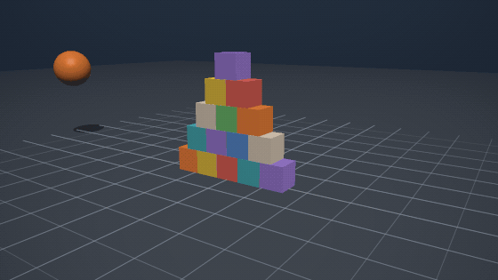
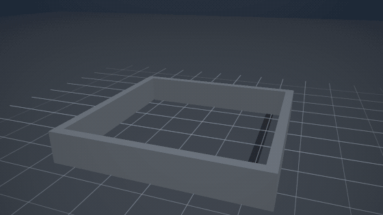
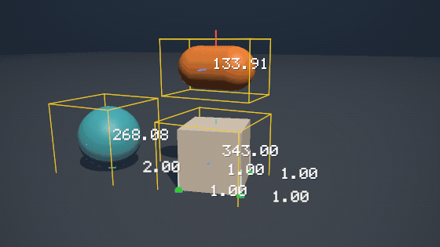
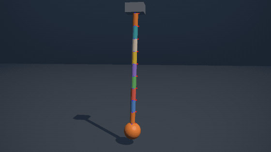
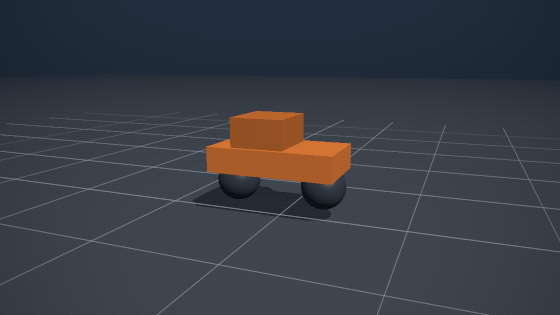
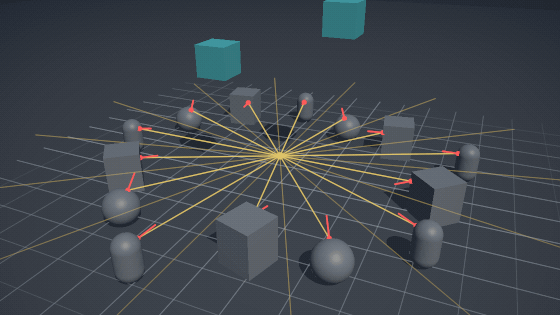
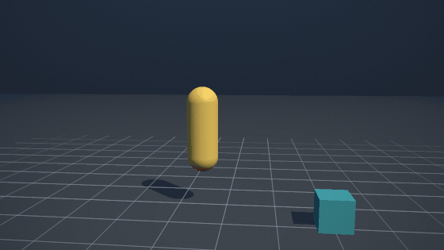
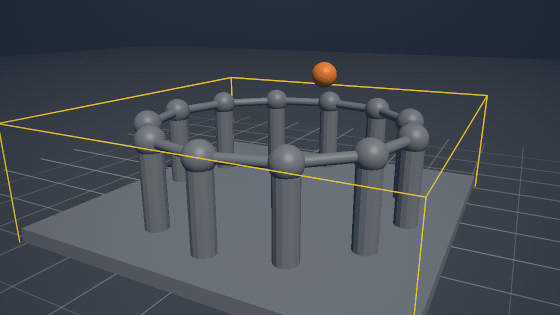
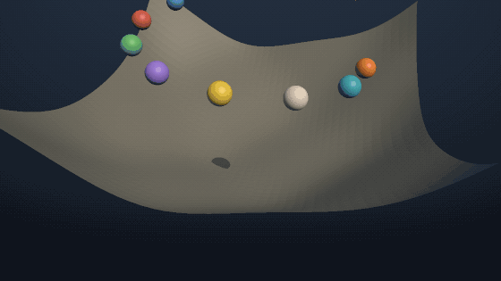

# Gallery

Nine scenes, each one a world built through the public API and photographed by
a renderer that knows nothing about Box3D beyond `IDebugDrawer` and
`IDebugShapeFactory`.

```sh
dotnet run --project src/Box3D.NET.Visualizer -- --list      # what there is
dotnet run --project src/Box3D.NET.Visualizer -- stack       # render one
dotnet run --project src/Box3D.NET.Visualizer                # render all of them
```

Everything on this page is generated by that command. Nothing is hand-drawn,
retouched or posed.

## stack



Fifteen boxes and a ball with a lot of momentum. The simplest thing a physics
engine does, and the one worth checking first.

## pour



Fifty-four bodies of three different shapes, dropped one every few steps into a
pen made of four static walls. Spheres roll, capsules settle on their sides,
boxes stack.

## contacts



The same simulation with the engine's own diagnostics turned on:
`DrawContacts`, `DrawContactNormals` and `DrawBounds`. Every dot is a point the
solver is working with, and every yellow box is a broad-phase bound.

Two draw calls rather than one, because the options apply to the whole call. The
first draws every shape; the second draws only the annotations, restricted with
`CategoryMask` to the dynamic bodies — the floor's bounding box is eighty metres
across and would be the only thing in the picture.

The numbers come out of the engine through `DrawString`, and are the reason the
renderer carries a font at all: the large one over each body is its mass, from
`DrawMass`, and the small one at each contact is that point's separation in
centimetres, from `DrawContactNormals`. `--font-card` renders a proof sheet of
all ninety-five glyphs.

The arrangement is chosen around those labels. Every contact point is annotated,
so a box resting squarely on another box costs four numbers where a capsule lying
on the same box costs two — which is why the thing on top of the crate is a
capsule, and why there is one crate rather than a pile of them.

## chain



Nine capsules and a weight, hinged end to end and set swinging about the anchor.
The small markers along it are the joint frames, drawn by the engine with
`DrawJoints`.

The chain starts hanging straight and is given angular velocity rather than
being built at an angle. A chain assembled already displaced has every joint
violated on the first step and snaps.

## vehicle



A chassis, two wheel joints with suspension and a motor on the rear one. The
bumps are static boxes; the take-off ramp at the end is a triangle mesh, which is
borrowed by the shape built from it rather than copied — so it is released after
the world, not before.

## raycast



Twenty-eight rays a frame, sweeping a full turn. Each one is `RaycastClosest`;
the dot is where it hit and the short red line is the surface normal there.

Rays are the one thing on this page the engine cannot draw for you. A cast
leaves no trace in the world, so the scene draws what it asked for and what came
back.

## character



The character controller from the samples, unchanged: gather the planes the
capsule is touching, solve them, clip the velocity. It turns orange on the
ground and yellow in the air.

The red marker under its feet is a plane the mover is solving against, drawn
through the capsule on purpose — an annotation hidden by the body it describes
shows nothing at all. Note that a contact point comes back *relative to the query
origin*, not in world space.

## compound



Thirty-seven children — a mesh plinth, twelve hull columns, twelve capsule
lintels and twelve sphere capitals — baked into a single `CompoundGeometry` and
attached with one call to `AddCompound`. The gold box is the broad-phase bound,
and there is exactly one of it: that is what a baked compound buys, and why Box3D
restricts it to static bodies.

The trade shows in the picture too. One shape means one filter, one set of events
and one colour; the children cannot be told apart from outside. For several
shapes that *can* be told apart, or on a body that moves, attach them to the body
one at a time instead — that is a run-time compound, and it works on any body
type.

This is also the only shape a renderer cannot draw unaided. Hulls, meshes and
height fields all have a `b3Shape_Get…` accessor; a compound has none, so the
scene hands the baked geometry to the shape factory itself. Without that the
columns would be missing and the balls would appear to bounce off nothing.

## terrain



A 41 by 41 height field with twelve balls dropped around the rim. The terrain
mesh is read back out of the engine's own compressed grid rather than from the
array it was built from, so the picture shows what the simulation is actually
colliding against — the quantization steps included, which are the faint terraces
visible across the slope.

## How the pictures are made

`src/Box3D.NET.Visualizer` is a console application with no dependencies beyond
the base class library. It contains a software rasterizer, a PNG writer and a
GIF writer, and it consumes `Box3D.NET` exactly as an application would.

That arrangement is the point. The library is deliberately renderer-agnostic —
it knows nothing about OpenGL, Vulkan, Unity or Godot — so the way to prove the
drawing interface is usable is to write a renderer against it and no other
privileged access.

There are two halves to that interface, and both are exercised here:

- **`IDebugShapeFactory`** is asked once per shape to build a drawable and hands
  back an opaque handle. The visualizer tessellates spheres and capsules from the
  handful of floats the engine passes, and reads hulls, meshes and height fields
  out of the engine through `Box3D.Interop` — the marked door down to the C API.
  Baked compounds are the one exception: there is no accessor for them, so the
  scene that baked one hands it over. A drawable is built once and reused for
  every frame after, which is the difference between rendering a five-second
  animation in seconds and in minutes.
- **`IDebugDrawer`** receives everything else each frame: the shape handles with
  their transforms, and the segments, points and boxes the diagnostics produce.
  It is a `struct` passed by `ref`, so the engine's side of the call allocates
  nothing.

Anything the engine cannot know about — a ray the scene cast, a character being
moved by the game rather than simulated — the scene draws itself, through the
same renderer.

### What the renderer does

Triangles, a depth buffer, one directional light with a hemisphere ambient, and
shadows projected onto a plane. It renders at three times the output size and
box-filters down, which is the whole anti-aliasing strategy.

Text is a 5x7 bitmap table, blitted in screen space with a one-pixel shadow so a
label stays readable on a white body and on the backdrop alike. It covers the
ninety-five printable ASCII characters, which is everything Box3D emits;
anything else is drawn as a question mark rather than dropped.

The output is written directly: PNG through `ZLibStream` with a Paeth filter per
scanline, and GIF with a median-cut palette shared across the animation, an
ordered dither, and only the rectangle that changed stored per frame. Each
animation is capped at seventy frames, with the sampling stride and the frame
delay derived together so that a longer scene samples itself more coarsely rather
than producing a heavier file.

### What it is not

It is not a renderer to build a game on. There is no texturing, no transparency,
no font beyond the bitmap table, and no glyph outside ASCII. A shape it cannot
tessellate — a baked compound the scene never handed over — is drawn as nothing
rather than drawn wrong, and the run reports how many of those it met.
