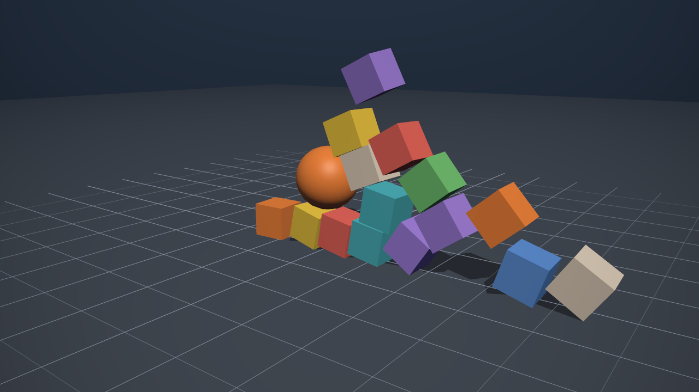

# Box3D.NET

An idiomatic C# binding for [Box3D](https://github.com/erincatto/box3d), the 3D
physics engine by Erin Catto, with no managed allocations on the simulation hot
path.

```sh
dotnet add package Box3D.NET
```

```csharp
using var world = new PhysicsWorld();

Body ground = world.CreateStaticBody(new Vector3(0.0f, -0.5f, 0.0f));
ground.AddBox(new Box(new Vector3(50.0f, 0.5f, 50.0f)));

Body ball = world.CreateDynamicBody(new Vector3(0.0f, 10.0f, 0.0f));
ball.AddSphere(new Sphere(0.5f));

for (int frame = 0; frame < 120; frame++)
{
    world.Step(1.0f / 60.0f);
}

Console.WriteLine(ball.Position);   // resting on the ground
```

That is the whole API for a first simulation: a world, some bodies, shapes on
them, and a step. Everything else is opt-in.

[**Getting started**](getting-started.md) ·
[Guides](guides/bodies.md) ·
[Examples](examples.md) ·
[API reference](api/index.md)

[](gallery.md)

## What you get

- Worlds, bodies, shapes, queries, events, all nine joint types, meshes, height
  fields, baked compounds, the character mover and debug draw.
- Zero managed allocations on the simulation path, including query callbacks,
  event enumeration and a drawn debug frame. Held to it by tests, not by
  assertion.
- `System.Numerics` types at the boundary, so no conversion between physics and
  your renderer.
- .NET 8 or later, Windows, Linux and macOS, x64 and arm64, NativeAOT and
  trimming.
- No dependencies beyond the base class library. The native binary ships in the
  package.

## Two packages

| Package | What it is |
| --- | --- |
| `Box3D.NET` | The idiomatic surface. This is what you want. |
| `Box3D.NET.Native` | The raw P/Invoke layer, a one-to-one mirror of the C API. |

`Box3D.NET` validates its input and never names a native type in public API.
[The native layer](concepts/native-layer.md) is the escape hatch for the
functions it does not cover yet, reached deliberately through a `using`.

## What it costs

Reading a body position through the wrapper costs 9.50 ns against the C API's
9.00 ns. A whole step is indistinguishable from the C API at 100, 1,000 and
10,000 bodies. Queries allocate nothing, including the callback forms.

[Benchmarks](benchmarks.md) has the method and the conditions.

## Where to go

| | |
| --- | --- |
| [Getting started](getting-started.md) | Install, first simulation, the loop |
| [Guides](guides/bodies.md) | Bodies, shapes, queries, events, joints, terrain, characters |
| [Concepts](concepts/step.md) | The step, ownership, handles, threading, the native layer |
| [Examples](examples.md) | Sixteen runnable samples |
| [Gallery](gallery.md) | Nine scenes, animated, drawn through the public interface |
| [API reference](api/index.md) | Every public type |

Status: 0.x. The API may still change between minor versions; every break is
recorded in the changelog, and packages are validated against the previous
release so none happens by accident.
